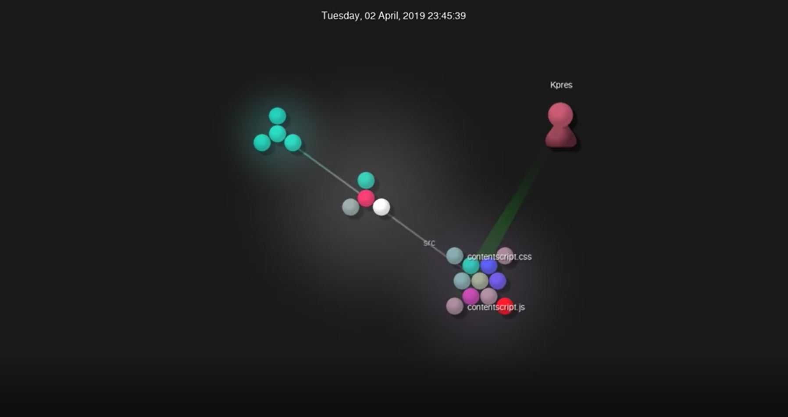
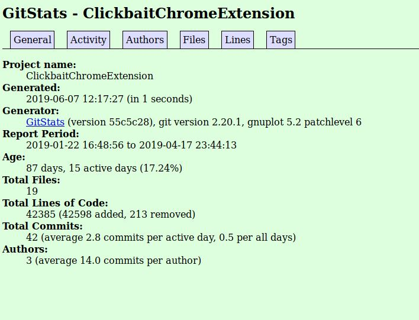

Latex Formulae: https://github.com/dpakalarry/OSSDevakPatel/blob/master/formula.tex \ \

Project: https://rcos.io/projects/kool814/clickbaitchromeextension/profile \
Contributors: 2 contributors \
Number of Lines of code: 42597 \
First Commit: Jan 25 2019 \
Most Recent Commit: Apr 17 2019 \
Current Branches: Master and SelectionJS 

GitStats: 
Contributors: 3 Authors \
Number of Lines of code: 42385 lines \
First Commit: Jan 2019 \
Most Recent Commit: Apr 2019 

Cybernetics-core
Project: https://rcos.io/projects/lockwo/cybernetics-core/profile
 
Git:
Contributors: 2
Number of Lines of Code: 11,352
First Commit: January 17th, 2019
Most Recent Commit: April 7th, 2019
Current Branches: 1
 
gitstats:
Contributors: 4
Number of Lines of Code: 1,522
First Commit: January 2019
Most Recent Commit: April 2019

Hands-up
Project: https://rcos.io/projects/v2grad/handsup/profile

Git: 
Contributors: 3 (asurashen [11], NeverBehave [5], haoyu0831 [4])
First Commit: init, by NeverBehave on April 11, 2019.
Latest Commit: create event confirm page is finished, by haoyu0831 on April 22, 2019. Total Lines: 10714

Gitstats: 
6 Active Days
107 Total Files
10692 Lines of Code (11300 added, 608 removed)
21 Total Commits (3.5 per active day)
First Commit: April 11, 2019.
Latest Commit: April 22, 2019. 
3 Authors, 7 commits on average

GEM-UNIVERSE
Project: https://rcos.io/projects/robert144144/gem-universe/profile
Git
* Name- GEM-UNIVERSE
* Contributors- 2
* Lines of Code- 3,358,302
* Commit Period- 12/24/18 - 05/08/19
* Current Branches- 1 Branch (Master)
* Total Commits- 37
 
Gitstats
* Name- GEM-UNIVERSE
* Contributors- 3
* Lines of Code- 231,339 (50,8764 added, 27,7425 removed)
* Commit Period- 12/24/18 - 05/08/19
* Total Commits: 37
* Age- 137 days, 26 active days
* Total Files- 1339

